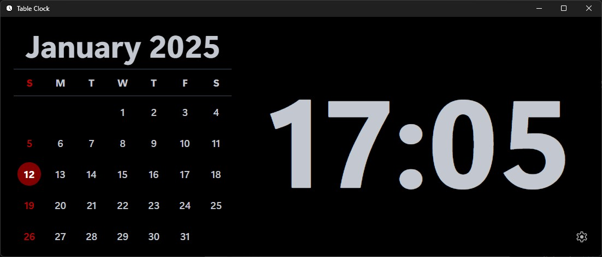
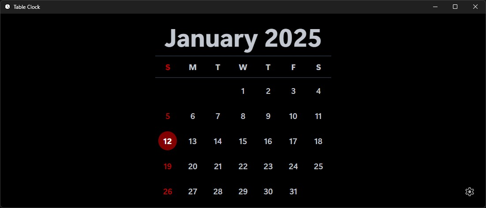
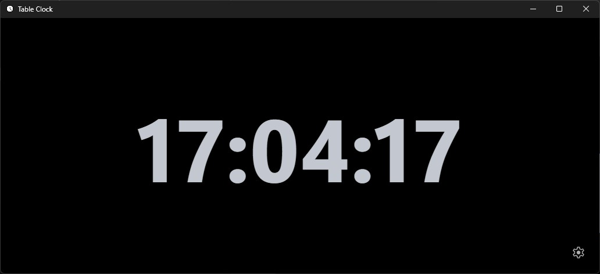

# Table Clock

## About

Table Clock is an app built with Tauri using Vite and Vue as the frontend. It turns your device into
a table clock display.

## Screenshots

### Calendar view

### Clock view with show seconds on

## Download

Download Table Clock at the
[release page](https://github.com/chapmankoo28/table-clock/releases/latest/).

### Available Platforms

-   Windows
-   Linux (deb)
-   Android APK

## Building

Building this Tauri app requires a few dependencies.

1. Bun is used as the package manager for this app. [Install Bun](https://bun.sh/)

2. Before building this app, follow the official
   [Tauri prerequisites guide](https://v2.tauri.app/start/prerequisites/).

3. Now, you can build your own by following the
   [Tauri building guide](https://v2.tauri.app/distribute/).

## Built With

-   [Material Design Icons](https://fonts.google.com/icons)
-   [Pico.css](https://picocss.com/)
-   [Tauri](https://v2.tauri.app/)
-   [Vite](https://vite.dev/)
-   [Vue](https://vuejs.org/)
